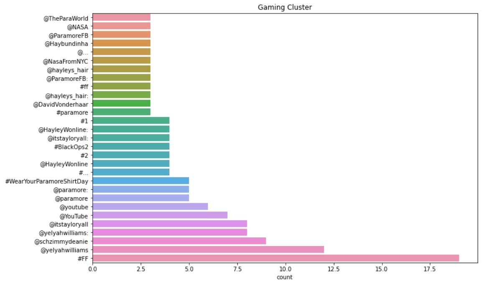
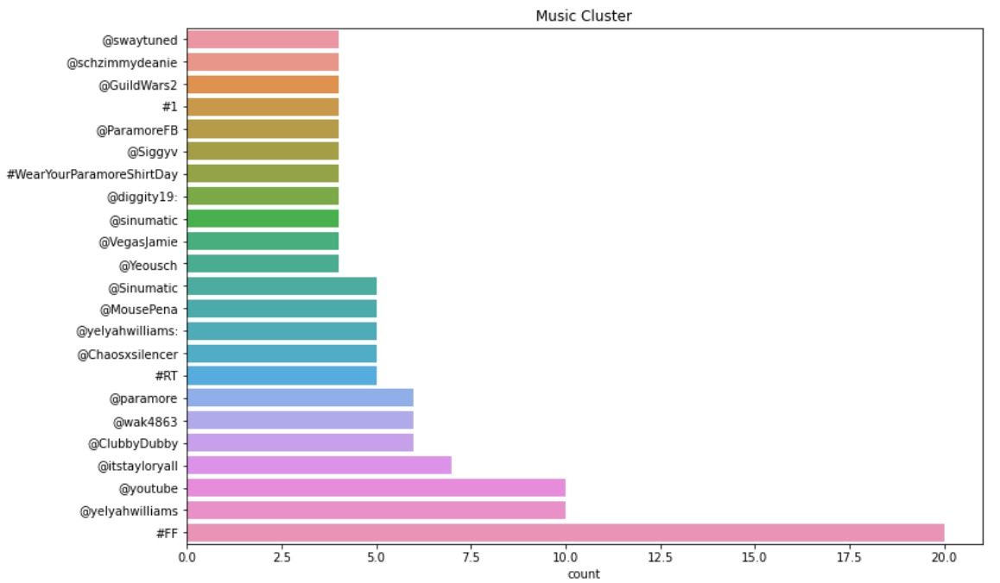
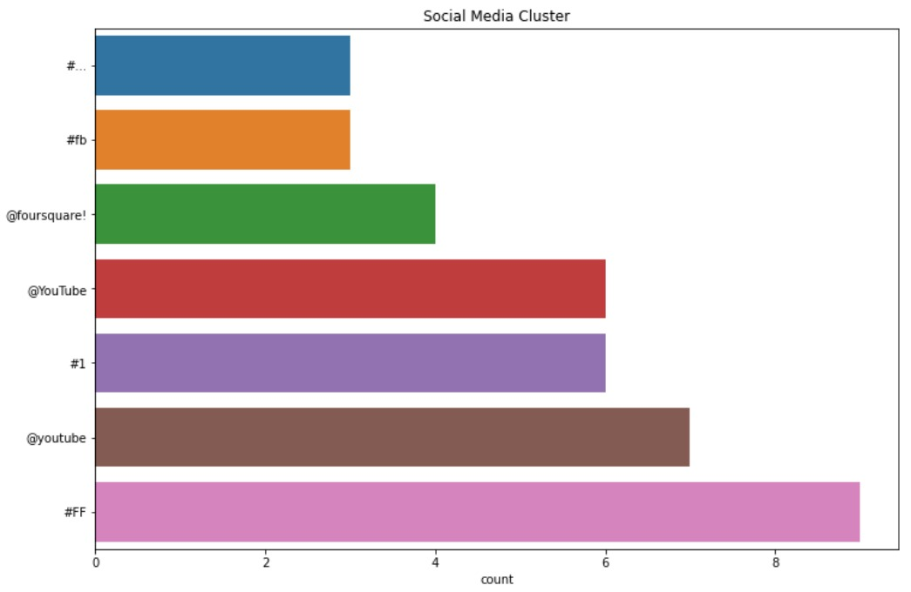

# Twitter-Community-Detection-Analysis-Sphere
The Twitter Community Detection project, operating under the name Analysis Sphere, is a comprehensive toolset designed to delve into the intricate web of Twitter communities. 

----

## Twitter Community Detection Clustering

This project delves into Twitter network analysis, employing graph-based models and various metrics to detect communities within the Twitter social network. Using sophisticated algorithms such as hierarchical clustering and leveraging metrics like closeness and betweenness centrality, the project aims to identify and analyze distinct communities present in the Twitter ecosystem.

### Key Components and Methodologies:
- **Graph-based models** for representing the Twitter network.
- **Hierarchical clustering** to group nodes based on connectivity.
- Metrics including **closeness** and **betweenness centrality** for node importance assessment.
- **Community detection algorithms** for identifying clusters of highly connected nodes.
- **Visualization tools** to showcase the detected communities within the Twitter network.

By utilizing graph-based models and hierarchical clustering, this project aims to dissect the intricate structure of the Twitter network. Metrics such as closeness and betweenness centrality help in evaluating the importance of nodes in the network, contributing to the identification of influential users or nodes. The project further employs community detection algorithms to reveal clusters of users with strong interconnections, providing insights into the underlying structure of the Twitter community.

----

## Mathematical Formulations

### 1. K-Means Clustering
K-means aims to partition `n` data points into `k` clusters by minimizing the within-cluster variance:

\[
\arg \min_{S} \sum_{i=1}^{k} \sum_{x \in S_i} \| x - \mu_i \|^2
\]

Where:
- \( S = \{ S_1, S_2, \ldots, S_k \} \): Clusters
- \( \mu_i \): Centroid of cluster \( S_i \)
- \( x \): Data point in cluster \( S_i \)
- \( \| x - \mu_i \|^2 \): Squared Euclidean distance between \( x \) and \( \mu_i \)

---

### 2. Agglomerative Clustering
Agglomerative clustering iteratively merges pairs of clusters based on a linkage criterion. The most common linkage metrics are:

- **Single Linkage (Min distance):**
\[
d(A, B) = \min_{a \in A, b \in B} \| a - b \|
\]

- **Complete Linkage (Max distance):**
\[
d(A, B) = \max_{a \in A, b \in B} \| a - b \|
\]

- **Average Linkage:**
\[
d(A, B) = \frac{1}{|A| |B|} \sum_{a \in A} \sum_{b \in B} \| a - b \|
\]

Where \( A \) and \( B \) are two clusters, and \( a \), \( b \) are data points.

---

### 3. Spectral Clustering
Spectral clustering transforms the data into a graph representation and uses eigenvectors of its Laplacian matrix to identify clusters.

1. Construct the similarity graph \( W \), where \( W_{ij} \) represents the similarity between points \( i \) and \( j \).
2. Compute the **graph Laplacian**:
   - Unnormalized: \( L = D - W \)
   - Normalized: \( L_{sym} = I - D^{-1/2} W D^{-1/2} \)
3. Solve the eigenvalue problem for \( L \) to get the top \( k \) eigenvectors corresponding to \( k \) clusters.
4. Apply K-means to the rows of the eigenvector matrix to assign cluster labels.

Where:
- \( W \): Adjacency (similarity) matrix
- \( D \): Degree matrix (\( D_{ii} = \sum_{j} W_{ij} \))
- \( L \): Graph Laplacian

---

## Visualizations of Clustering Results

### Gaming Cluster

The gaming cluster highlights the interconnected communities of users sharing gaming-related content, showcasing strong ties between influencers, fans, and brands within the gaming ecosystem.

---

### Music Cluster

The music cluster reveals the dynamic communities formed by artists, fans, and music enthusiasts, displaying a tightly-knit network of interactions.

---

### Media Cluster

The media cluster identifies the interaction patterns of news outlets, journalists, and their audiences, uncovering the key players and sub-communities within the media domain.

---

Explore the complexities of the Twitter network, uncover influential nodes, and identify vibrant communities within the social ecosystem using this comprehensive Twitter Community Detection project.
